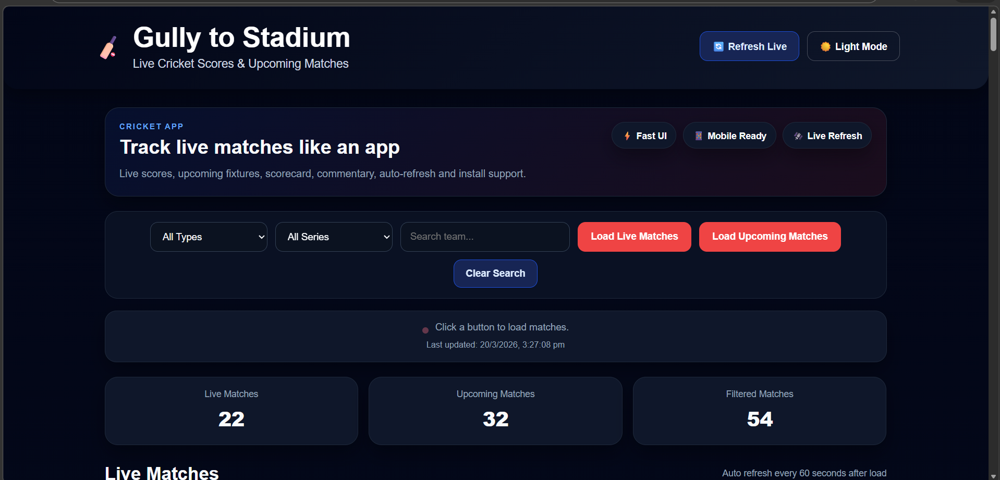

# 🏏 Gully to Stadium Cricket App


A modern **cricket web application** that provides live match scores, upcoming matches, detailed scorecards, and ball-by-ball commentary — designed with a professional UI similar to Cricbuzz.

---

## 🚀 Features

* 🔴 Live Cricket Matches
* 📅 Upcoming Matches
* 🔍 Search & Filters (Match Type & Series)
* 📊 Detailed Scorecard
* 📝 Ball-by-Ball Commentary
* ⚡ Auto Refresh (Live updates every 60s)
* 🌙 Dark Mode Support
* 📱 Fully Responsive (Mobile + Desktop)
* 📦 Installable App (PWA support)

---

## 🛠️ Tech Stack

* HTML5
* CSS3
* JavaScript (Vanilla JS)
* CricAPI (Live Data)
* Service Worker (Offline Support)
* Web App Manifest (PWA)

---

## 📸 Screenshots



---

## 🌐 Live Demo

👉 https://sknaseeruddin.github.io/gully-to-stadium-cricket-app/

---

## 📦 Installation (App)

1. Open the website in Chrome
2. Click **"Install App"**
3. Add to Home Screen
4. Use like a mobile app

---

## 📂 Project Structure

```
gully-to-stadium-cricket-app/
│── index.html
│── style.css
│── script.js
│── manifest.json
│── sw.js
│── Screenshot.png
└── icons/
    │── icon-192.png
    └── icon-512.png
```

---

## ⚠️ Note

* Live data depends on API limits
* If API limit is exceeded → demo/fallback data is shown
* For production use, upgrade API plan

---

## 👨‍💻 Author

**Naseeruddin Sharif Shaik**

* GitHub: https://github.com/sknaseeruddin

---

## ⭐ Support

If you like this project:

👉 Give it a ⭐ on GitHub
👉 Share with others
👉 Use it in your portfolio

---
